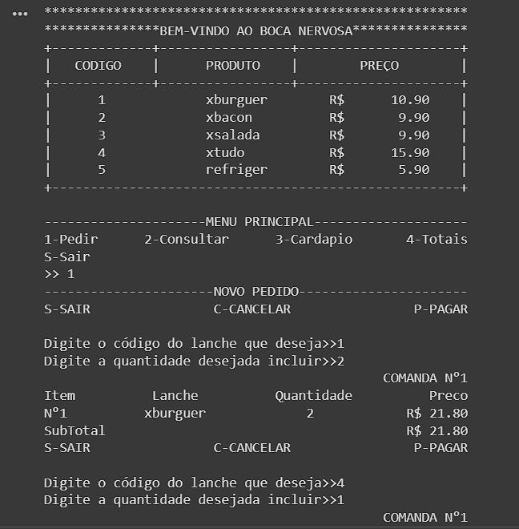
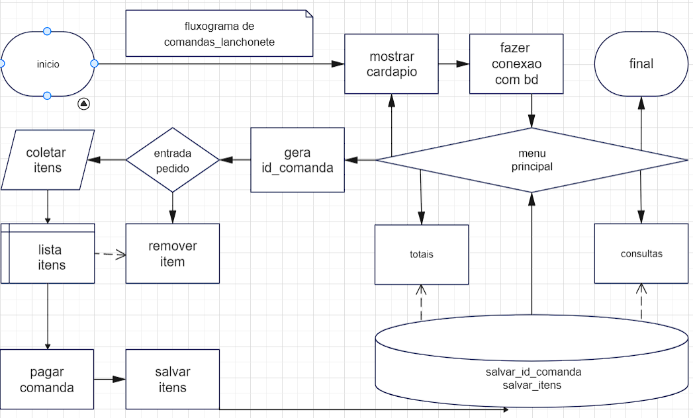

# Controle de Comandas em Lanchonete


## Descrição
Este software gerencia o controle de comandas em uma lanchonete. Ele permite aos usuários fazer pedidos, consultar comandas, ver o cardápio e calcular o total de vendas do dia. As funcionalidades são implementadas em Python, utilizando listas e dicionários para armazenar os dados dos produtos e das comandas.

## Funcionalidades

### `Cardapio`
Exibe o cardápio com os produtos disponíveis e seus respectivos preços.

### `Entrada de pedidos`
Gerencia a entrada de pedidos de uma comanda específica.
- Permite adicionar itens ao pedido.
- Possibilita a remoção de itens.
- Exibe o subtotal do pedido.
- Finaliza e registra o pedido para pagamento.

### `Coletar`
Coleta a quantidade de um item específico e atualiza o valor total do pedido.

### `Remover`
Remove um item específico de um pedido e atualiza o valor total.

### `Consultar`
Permite a consulta das comandas registradas.
- Exibe todas as comandas ou uma específica.

### `Pagar`
- Salva a lista_desejo como uma comanda "Paga" no BD MySQL.

### `Totais`
- Calcula e exibe o total de vendas por item,comanda, totais, quantidade de itens e valor monetário.

## Estrutura do Código
```plaintext
├── comanda_lanchonete
    ├── Modulo_candapio
        └── dicionario
    ├── modulo_conexao
    ├── modulo_entrada_pedidos
        ├── modulo_comanda
        ├── modulo_coleta
            └── dicionario
        ├── modulo_pagar
            ├── modulo_salvar
                └── BD MySQL
    ├── modulo_consultar
        └── BD MySQL
    ├── modulo_totais
        └── BD MySQL
    └── Sair
```
### fluxograma

### Produtos Pré-carregados
```python
dic = [
    {"cod": "1", "lanche": "xburguer", "preco": 10.90},
    {"cod": "2", "lanche": "xbacon", "preco": 9.90},
    {"cod": "3", "lanche": "xsalada", "preco": 9.90},
    {"cod": "4", "lanche": "xtudo", "preco": 15.90},
    {"cod": "5", "lanche": "refriger", "preco": 5.90}
]
```
### Variáveis Globais
- `lista_produto`: Lista que armazena todos os produtos pedidos durante o dia.
- `lista_desejo`: Lista temporária para armazenar os itens do pedido atual.
- `n_comanda`: Contador de comandas.
- `dicionario`: Dicionário temporário para armazenar os dados de um item do pedido.
## Conclusão
Este software fornece uma solução completa para o gerenciamento de comandas em uma lanchonete, permitindo uma operação eficiente e organizada das vendas e pedidos com a utilização do banco de dados MySQL.

## Desenvolvedor
Deleon Santos
- Este sitema foi desenvolvido em carater academico e sua concepção inspirou possibilitou a criação do 


